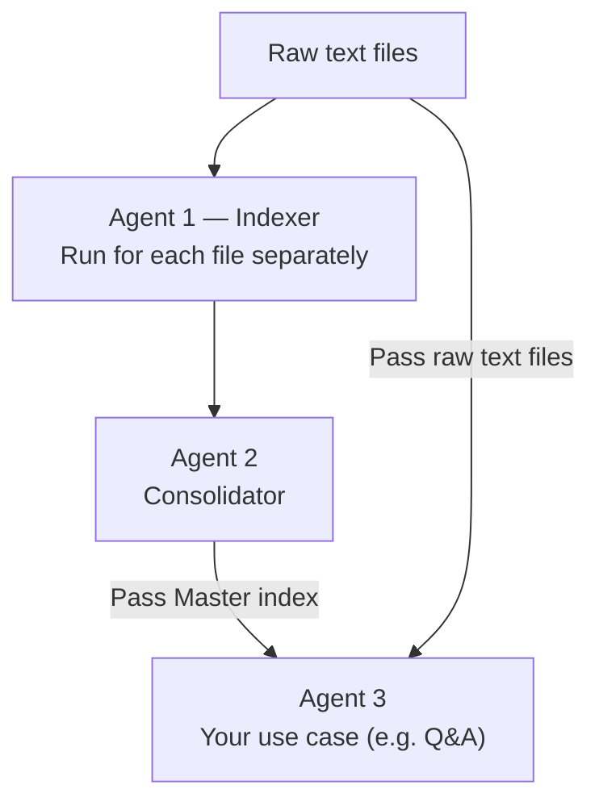

# Bulk Text Index Agents

When dealing with massive amounts of text—like multiple days of raw transcripts, huge codebases, or years of logs—querying an LLM directly is a nightmare. The context window gets bloated, latency goes through the roof, and the model starts hallucinating or losing the thread.

This repo outlines a multi-agent architectural pattern to handle bulk text efficiently using an in-house Copilot. It scales to massive datasets without losing context or accuracy.

## The Architecture

Instead of feeding all raw files to a single agent, we split the workload:

1. **Indexer Agent:** Runs independently for *each* file, extracting a local index.
2. **Consolidator Agent:** Takes all local indexes and merges them into a single Master Index.
3. **Use Case Agent (e.g. Q&A):** Uses the Master Index to quickly locate the exact raw files needed, then reads only those files to complete the task.

